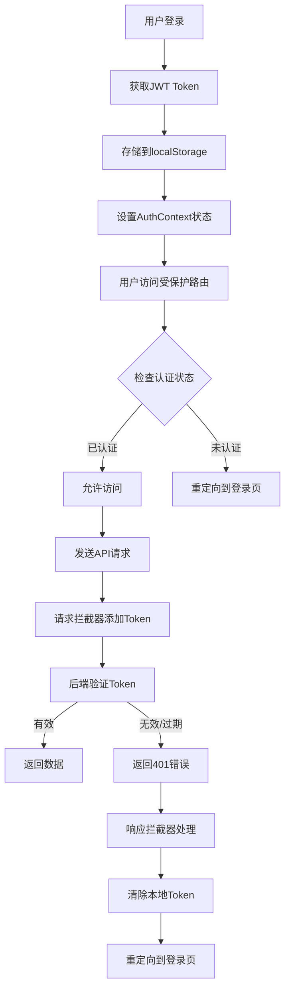
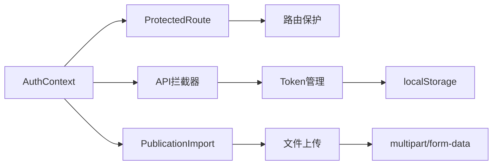

# 设计文档

## 概述

本设计文档针对协和医院SCI期刊分析系统的认证问题提供系统性解决方案。主要问题是用户登录后访问批量导入功能时被重定向到登录页面，这表明认证机制存在多个潜在问题需要修复。

通过分析现有代码，发现问题可能出现在以下几个层面：
1. 前端token管理和验证逻辑
2. API请求拦截器的认证处理
3. 路由保护机制的实现
4. 后端认证中间件的错误处理
5. 认证状态在组件间的同步

## 架构

### 认证流程架构



### 组件交互架构



## 组件和接口

### 1. AuthContext增强

**现有问题：**
- token验证逻辑不够健壮
- 缺少token刷新机制
- 状态同步机制不完善

**设计改进：**
```typescript
interface AuthContextType {
  state: AuthState;
  login: (username: string, password: string) => Promise<boolean>;
  logout: () => void;
  refreshToken: () => Promise<boolean>; // 新增
  validateToken: () => Promise<boolean>; // 新增
  updateUser: (user: User) => void;
  hasPermission: (resource: string, action: string) => boolean;
  hasRole: (roles: string | string[]) => boolean;
  isTokenValid: () => boolean; // 新增
}

interface AuthState {
  user: User | null;
  token: string | null;
  isLoading: boolean;
  isAuthenticated: boolean;
  tokenExpiry: number | null; // 新增
  lastValidated: number | null; // 新增
}
```

### 2. API拦截器重构

**现有问题：**
- 文件上传请求的认证处理不当
- 错误处理逻辑不够完善
- 缺少重试机制

**设计改进：**
```typescript
// 请求拦截器增强
const requestInterceptor = (config: AxiosRequestConfig) => {
  const token = getValidToken(); // 新的token获取逻辑
  if (token) {
    config.headers = config.headers || {};
    config.headers.Authorization = `Bearer ${token}`;
  }
  
  // 特殊处理文件上传
  if (config.data instanceof FormData) {
    // 不设置Content-Type，让浏览器自动设置
    delete config.headers['Content-Type'];
  }
  
  return config;
};

// 响应拦截器增强
const responseInterceptor = {
  success: (response: AxiosResponse) => response,
  error: async (error: AxiosError) => {
    if (error.response?.status === 401) {
      await handleAuthError(error);
    } else if (error.response?.status === 403) {
      handlePermissionError(error);
    }
    return Promise.reject(error);
  }
};
```

### 3. ProtectedRoute组件优化

**现有问题：**
- 加载状态处理不够友好
- 权限检查逻辑可以优化
- 缺少重定向路径保存

**设计改进：**
```typescript
interface ProtectedRouteProps {
  children: ReactNode;
  requiredRoles?: string[];
  requiredPermissions?: Array<{ resource: string; action: string }>;
  fallback?: ReactNode; // 新增自定义加载组件
  redirectPath?: string; // 新增自定义重定向路径
}

const ProtectedRoute: React.FC<ProtectedRouteProps> = ({
  children,
  requiredRoles,
  requiredPermissions,
  fallback,
  redirectPath = '/login'
}) => {
  // 增强的认证检查逻辑
  // 保存原始访问路径
  // 优化加载状态显示
};
```

### 4. Token管理工具类

**新增设计：**
```typescript
class TokenManager {
  private static instance: TokenManager;
  
  static getInstance(): TokenManager {
    if (!TokenManager.instance) {
      TokenManager.instance = new TokenManager();
    }
    return TokenManager.instance;
  }
  
  getToken(): string | null;
  setToken(token: string, expiry?: number): void;
  removeToken(): void;
  isTokenValid(): boolean;
  isTokenExpired(): boolean;
  getTokenExpiry(): number | null;
  refreshToken(): Promise<string | null>;
  
  // 监听localStorage变化实现跨标签页同步
  private setupStorageListener(): void;
}
```

## 数据模型

### Token存储结构

```typescript
interface TokenData {
  token: string;
  expiry: number;
  refreshToken?: string;
  lastValidated: number;
}

// localStorage存储格式
const STORAGE_KEYS = {
  TOKEN: 'auth_token',
  TOKEN_DATA: 'auth_token_data',
  USER: 'auth_user',
  REDIRECT_PATH: 'auth_redirect_path'
};
```

### 错误响应结构

```typescript
interface AuthError {
  code: 'AUTHENTICATION_ERROR' | 'AUTHORIZATION_ERROR' | 'TOKEN_EXPIRED';
  message: string;
  details?: {
    required?: string[];
    current?: string;
    expiry?: number;
  };
}
```

## 错误处理

### 1. 认证错误分类

```typescript
enum AuthErrorType {
  TOKEN_MISSING = 'TOKEN_MISSING',
  TOKEN_INVALID = 'TOKEN_INVALID', 
  TOKEN_EXPIRED = 'TOKEN_EXPIRED',
  USER_INACTIVE = 'USER_INACTIVE',
  PERMISSION_DENIED = 'PERMISSION_DENIED',
  NETWORK_ERROR = 'NETWORK_ERROR',
  SERVER_ERROR = 'SERVER_ERROR'
}
```

### 2. 错误处理策略

```typescript
const errorHandlers = {
  [AuthErrorType.TOKEN_EXPIRED]: async () => {
    // 尝试刷新token
    const refreshed = await TokenManager.getInstance().refreshToken();
    if (!refreshed) {
      // 重定向到登录页
      redirectToLogin();
    }
  },
  
  [AuthErrorType.TOKEN_INVALID]: () => {
    // 清除本地数据并重定向
    TokenManager.getInstance().removeToken();
    redirectToLogin();
  },
  
  [AuthErrorType.PERMISSION_DENIED]: (error: AuthError) => {
    // 显示权限不足页面
    showPermissionDeniedPage(error.details);
  }
};
```

### 3. 用户友好的错误提示

```typescript
const errorMessages = {
  [AuthErrorType.TOKEN_EXPIRED]: '登录已过期，请重新登录',
  [AuthErrorType.TOKEN_INVALID]: '登录状态异常，请重新登录',
  [AuthErrorType.PERMISSION_DENIED]: '权限不足，无法访问此功能',
  [AuthErrorType.NETWORK_ERROR]: '网络连接异常，请检查网络后重试',
  [AuthErrorType.SERVER_ERROR]: '服务器异常，请稍后重试'
};
```

## 测试策略

### 1. 单元测试

- AuthContext的各种状态转换
- TokenManager的token管理逻辑
- API拦截器的请求/响应处理
- ProtectedRoute的权限检查逻辑

### 2. 集成测试

- 完整的登录流程测试
- 文件上传的认证流程测试
- 跨标签页状态同步测试
- 错误场景的处理测试

### 3. 端到端测试

- 用户登录后访问批量导入功能
- Token过期后的自动处理
- 权限不足时的用户体验
- 网络异常时的错误处理

## 实施计划

### 阶段1：核心认证机制修复
1. 重构TokenManager类
2. 优化AuthContext的token验证逻辑
3. 修复API拦截器的认证处理

### 阶段2：路由保护增强
1. 优化ProtectedRoute组件
2. 实现重定向路径保存
3. 改进加载状态显示

### 阶段3：错误处理完善
1. 实现统一的错误处理机制
2. 添加用户友好的错误提示
3. 实现跨标签页状态同步

### 阶段4：批量导入功能修复
1. 修复文件上传的认证问题
2. 优化PublicationImport组件
3. 测试完整的导入流程

### 阶段5：测试和优化
1. 编写全面的测试用例
2. 性能优化和用户体验改进
3. 文档更新和部署

## 性能考虑

1. **Token验证缓存**：避免频繁的token有效性检查
2. **懒加载验证**：只在必要时进行用户信息验证
3. **请求去重**：避免重复的认证请求
4. **内存管理**：及时清理过期的认证数据

## 安全考虑

1. **Token安全存储**：考虑使用httpOnly cookie替代localStorage
2. **CSRF防护**：添加CSRF token验证
3. **XSS防护**：确保token不会被恶意脚本获取
4. **会话管理**：实现安全的会话超时机制