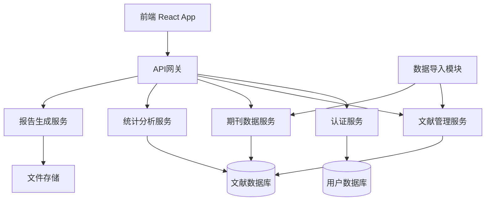
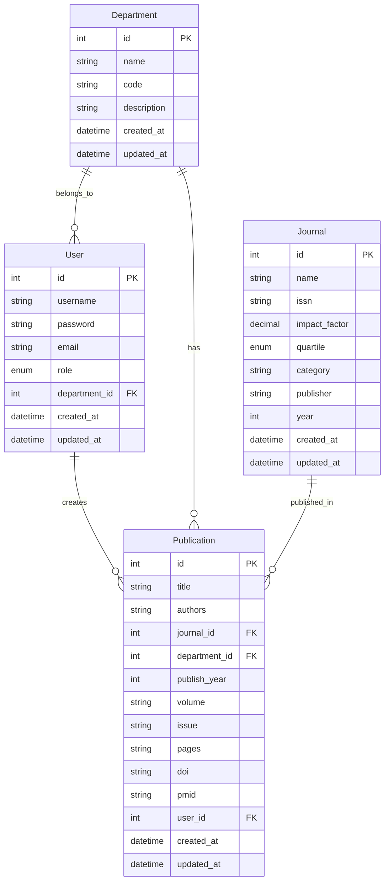

# 设计文档

## 概述

协和医院SCI期刊分析系统采用前后端分离的架构设计，后端使用Node.js + Express + MySQL构建RESTful API，前端使用React + TypeScript + Ant Design构建现代化的Web界面。系统支持数据导入、统计分析、可视化展示和报告生成等功能。

## 架构设计

### 系统架构图



### 技术栈选择

**后端技术栈：**
- Node.js + Express.js：轻量级、高性能的Web框架
- MySQL：关系型数据库，适合结构化数据存储
- Sequelize ORM：数据库操作抽象层
- JWT：用户认证和授权
- Multer：文件上传处理
- ExcelJS：Excel文件处理
- PDFKit：PDF报告生成

**前端技术栈：**
- React 18 + TypeScript：现代化前端框架
- Ant Design：企业级UI组件库
- ECharts：数据可视化图表库
- Axios：HTTP客户端
- React Router：路由管理
- Redux Toolkit：状态管理

## 组件和接口设计

### 数据模型

#### 用户模型 (User)
```typescript
interface User {
  id: number;
  username: string;
  password: string; // 加密存储
  email: string;
  role: 'admin' | 'department_admin' | 'user';
  departmentId?: number;
  createdAt: Date;
  updatedAt: Date;
}
```

#### 科室模型 (Department)
```typescript
interface Department {
  id: number;
  name: string;
  code: string;
  description?: string;
  createdAt: Date;
  updatedAt: Date;
}
```

#### 期刊模型 (Journal)
```typescript
interface Journal {
  id: number;
  name: string;
  issn?: string;
  impactFactor: number;
  quartile: 'Q1' | 'Q2' | 'Q3' | 'Q4';
  category: string;
  publisher?: string;
  year: number;
  createdAt: Date;
  updatedAt: Date;
}
```

#### 文献模型 (Publication)
```typescript
interface Publication {
  id: number;
  title: string;
  authors: string;
  journalId: number;
  departmentId: number;
  publishYear: number;
  volume?: string;
  issue?: string;
  pages?: string;
  doi?: string;
  pmid?: string;
  userId: number; // 录入人
  createdAt: Date;
  updatedAt: Date;
}
```

### API接口设计

#### 认证接口
```typescript
// POST /api/auth/login
interface LoginRequest {
  username: string;
  password: string;
}

interface LoginResponse {
  token: string;
  user: User;
}

// POST /api/auth/register
interface RegisterRequest {
  username: string;
  password: string;
  email: string;
  role: string;
  departmentId?: number;
}
```

#### 期刊管理接口
```typescript
// GET /api/journals
interface JournalListResponse {
  journals: Journal[];
  total: number;
  page: number;
  pageSize: number;
}

// POST /api/journals/import
interface JournalImportRequest {
  file: File; // Excel/CSV文件
}

interface JournalImportResponse {
  success: number;
  failed: number;
  duplicates: number;
  errors: string[];
}

// GET /api/journals/search?q=keyword
interface JournalSearchResponse {
  journals: Journal[];
}
```

#### 文献管理接口
```typescript
// GET /api/publications
interface PublicationListRequest {
  page?: number;
  pageSize?: number;
  departmentId?: number;
  year?: number;
  journalId?: number;
  keyword?: string;
}

// POST /api/publications
interface CreatePublicationRequest {
  title: string;
  authors: string;
  journalId: number;
  departmentId: number;
  publishYear: number;
  volume?: string;
  issue?: string;
  pages?: string;
  doi?: string;
}

// POST /api/publications/import
interface PublicationImportRequest {
  file: File;
  departmentId: number;
}
```

#### 统计分析接口
```typescript
// GET /api/statistics/department
interface DepartmentStatisticsResponse {
  departmentId: number;
  departmentName: string;
  totalPublications: number;
  averageImpactFactor: number;
  quartileDistribution: {
    Q1: number;
    Q2: number;
    Q3: number;
    Q4: number;
  };
  yearlyTrend: Array<{
    year: number;
    count: number;
  }>;
}

// GET /api/statistics/overview
interface OverviewStatisticsResponse {
  totalPublications: number;
  totalDepartments: number;
  averageImpactFactor: number;
  topDepartments: Array<{
    departmentName: string;
    publicationCount: number;
  }>;
  yearlyTrend: Array<{
    year: number;
    count: number;
  }>;
}
```

### 前端组件架构

#### 页面组件结构
```
src/
├── components/
│   ├── common/
│   │   ├── Layout/
│   │   ├── Header/
│   │   └── Sidebar/
│   ├── charts/
│   │   ├── BarChart/
│   │   ├── PieChart/
│   │   └── LineChart/
│   └── forms/
│       ├── PublicationForm/
│       ├── JournalImport/
│       └── DataImport/
├── pages/
│   ├── Dashboard/
│   ├── Publications/
│   ├── Journals/
│   ├── Statistics/
│   ├── Reports/
│   └── Settings/
├── services/
│   ├── api.ts
│   ├── auth.ts
│   └── statistics.ts
├── store/
│   ├── authSlice.ts
│   ├── publicationSlice.ts
│   └── statisticsSlice.ts
└── utils/
    ├── constants.ts
    ├── helpers.ts
    └── validators.ts
```

## 数据模型

### 数据库设计

#### 表关系图


### 数据验证规则

#### 期刊数据验证
- 期刊名称：必填，最大长度200字符
- 影响因子：必填，数值类型，范围0-50
- 分区：必填，枚举值Q1/Q2/Q3/Q4
- 年份：必填，范围1900-当前年份

#### 文献数据验证
- 标题：必填，最大长度500字符
- 作者：必填，最大长度1000字符
- 发表年份：必填，范围1900-当前年份
- DOI：可选，格式验证
- 科室：必填，必须存在于科室表中

## 错误处理

### 错误分类和处理策略

#### 客户端错误处理
```typescript
interface ApiError {
  code: string;
  message: string;
  details?: any;
}

// 错误码定义
enum ErrorCodes {
  VALIDATION_ERROR = 'VALIDATION_ERROR',
  AUTHENTICATION_ERROR = 'AUTHENTICATION_ERROR',
  AUTHORIZATION_ERROR = 'AUTHORIZATION_ERROR',
  RESOURCE_NOT_FOUND = 'RESOURCE_NOT_FOUND',
  DUPLICATE_RESOURCE = 'DUPLICATE_RESOURCE',
  FILE_UPLOAD_ERROR = 'FILE_UPLOAD_ERROR',
  DATABASE_ERROR = 'DATABASE_ERROR',
  EXTERNAL_SERVICE_ERROR = 'EXTERNAL_SERVICE_ERROR'
}
```

#### 服务端错误处理中间件
- 全局异常捕获和日志记录
- 统一错误响应格式
- 敏感信息过滤
- 错误监控和告警

#### 前端错误处理
- 全局错误边界组件
- API请求错误拦截
- 用户友好的错误提示
- 错误重试机制

## 测试策略

### 后端测试
- **单元测试**：使用Jest测试业务逻辑和工具函数
- **集成测试**：测试API接口和数据库交互
- **端到端测试**：使用Supertest测试完整的请求流程

### 前端测试
- **组件测试**：使用React Testing Library测试组件行为
- **集成测试**：测试页面级别的用户交互
- **视觉回归测试**：确保UI的一致性

### 测试覆盖率目标
- 后端代码覆盖率：≥80%
- 前端组件覆盖率：≥70%
- 关键业务逻辑覆盖率：≥90%

### 性能测试
- API响应时间：≤200ms（95%请求）
- 页面加载时间：≤3秒
- 大文件上传：支持≤10MB的Excel文件
- 并发用户：支持≤100个并发用户

## 安全考虑

### 认证和授权
- JWT token过期时间：2小时
- 密码加密：使用bcrypt，salt rounds=12
- 角色权限控制：基于RBAC模型
- API访问频率限制：每分钟100次请求

### 数据安全
- 敏感数据加密存储
- SQL注入防护
- XSS攻击防护
- CSRF攻击防护
- 文件上传安全检查

### 审计日志
- 用户操作日志记录
- 数据变更追踪
- 登录失败监控
- 异常访问告警