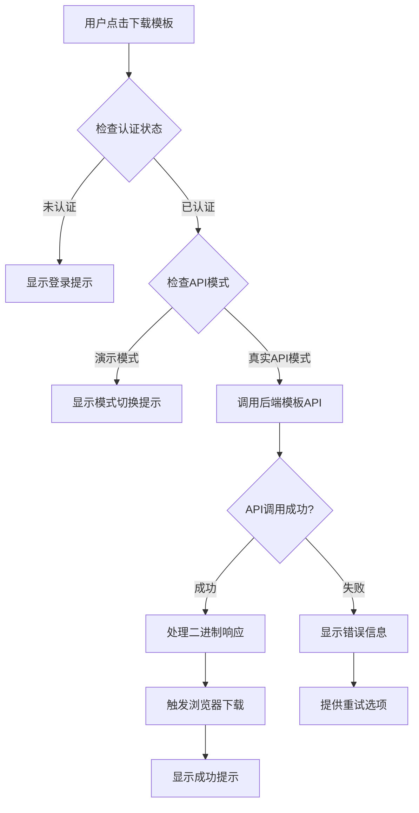
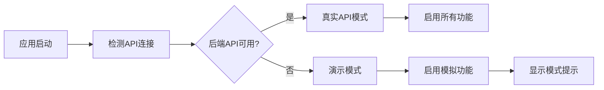

# 设计文档

## 概述

本设计文档针对协和医院SCI期刊分析系统的模板下载功能修复和演示模式退出问题提供解决方案。通过分析现有代码，发现以下问题：

1. **期刊导入模板下载功能未实现**：JournalImport组件中的下载模板功能只显示"开发中"消息
2. **文献导入模板下载可能存在问题**：虽然有API调用，但可能存在文件格式或认证问题
3. **演示模式检测和切换**：需要识别当前是否在演示模式，并提供切换到真实API的机制
4. **后端模板生成API需要完善**：确保后端能正确生成和返回Excel模板文件

## 架构

### 模板下载流程架构



### 系统模式检测架构



## 组件和接口

### 1. 模板下载API接口设计

#### 后端API接口

```typescript
// 文献导入模板下载
GET /api/publications/template/download
Headers: {
  Authorization: Bearer <token>
}
Response: {
  Content-Type: application/vnd.openxmlformats-officedocument.spreadsheetml.sheet
  Content-Disposition: attachment; filename="文献导入模板_YYYYMMDD.xlsx"
  Body: <Excel文件二进制数据>
}

// 期刊导入模板下载  
GET /api/journals/template/download
Headers: {
  Authorization: Bearer <token>
}
Response: {
  Content-Type: application/vnd.openxmlformats-officedocument.spreadsheetml.sheet
  Content-Disposition: attachment; filename="期刊导入模板_YYYYMMDD.xlsx"
  Body: <Excel文件二进制数据>
}

// API状态检查
GET /api/health
Response: {
  status: "ok" | "error",
  mode: "production" | "development",
  timestamp: number,
  services: {
    database: "connected" | "disconnected",
    auth: "active" | "inactive"
  }
}
```

#### 前端API调用接口

```typescript
interface TemplateDownloadService {
  downloadPublicationTemplate(): Promise<Blob>;
  downloadJournalTemplate(): Promise<Blob>;
  checkApiStatus(): Promise<ApiStatus>;
  isRealApiMode(): boolean;
  switchToRealApi(): Promise<boolean>;
}

interface ApiStatus {
  isAvailable: boolean;
  mode: 'demo' | 'real';
  lastChecked: number;
  error?: string;
}
```

### 2. 模板生成器增强

```typescript
interface TemplateConfig {
  type: 'publication' | 'journal';
  includeExamples: boolean;
  includeInstructions: boolean;
  language: 'zh' | 'en';
  format: 'xlsx' | 'csv';
}

interface TemplateField {
  key: string;
  header: string;
  width: number;
  required: boolean;
  type: 'string' | 'number' | 'date' | 'enum';
  validation?: {
    pattern?: string;
    min?: number;
    max?: number;
    options?: string[];
  };
  example?: string;
  description?: string;
}

class EnhancedTemplateGenerator {
  static generateTemplate(config: TemplateConfig): Promise<Buffer>;
  static getTemplateFields(type: 'publication' | 'journal'): TemplateField[];
  static validateTemplateData(data: any[], type: 'publication' | 'journal'): ValidationResult;
}
```

### 3. 前端下载处理组件

```typescript
interface DownloadButtonProps {
  type: 'publication' | 'journal';
  disabled?: boolean;
  onSuccess?: () => void;
  onError?: (error: Error) => void;
}

const TemplateDownloadButton: React.FC<DownloadButtonProps> = ({
  type,
  disabled,
  onSuccess,
  onError
}) => {
  const [loading, setLoading] = useState(false);
  const [apiMode, setApiMode] = useState<'demo' | 'real'>('demo');
  
  // 下载处理逻辑
  const handleDownload = async () => {
    // 实现下载逻辑
  };
  
  // 模式切换处理
  const handleModeSwitch = async () => {
    // 实现模式切换逻辑
  };
  
  return (
    <Space>
      <Button
        icon={<DownloadOutlined />}
        onClick={handleDownload}
        loading={loading}
        disabled={disabled}
      >
        下载模板
      </Button>
      {apiMode === 'demo' && (
        <Button
          type="link"
          onClick={handleModeSwitch}
          size="small"
        >
          切换到真实API
        </Button>
      )}
    </Space>
  );
};
```

## 数据模型

### 1. 文献导入模板字段定义

```typescript
const PUBLICATION_TEMPLATE_FIELDS: TemplateField[] = [
  {
    key: 'wosNumber',
    header: 'WOS号',
    width: 20,
    required: false,
    type: 'string',
    example: 'WOS:000123456789',
    description: 'Web of Science数据库唯一标识符'
  },
  {
    key: 'title',
    header: '文章标题',
    width: 50,
    required: true,
    type: 'string',
    validation: { min: 1, max: 500 },
    example: '协和医院SCI研究成果示例',
    description: '文献的完整标题'
  },
  {
    key: 'authors',
    header: '作者',
    width: 40,
    required: true,
    type: 'string',
    validation: { min: 1, max: 1000 },
    example: '张三, 李四, 王五',
    description: '所有作者姓名，用逗号分隔'
  },
  {
    key: 'journalName',
    header: '期刊名称',
    width: 40,
    required: true,
    type: 'string',
    example: 'Nature Medicine',
    description: '期刊的完整名称'
  },
  {
    key: 'publishYear',
    header: '发表年份',
    width: 10,
    required: true,
    type: 'number',
    validation: { min: 1900, max: new Date().getFullYear() },
    example: 2024,
    description: '文献发表年份'
  },
  {
    key: 'departmentName',
    header: '科室',
    width: 20,
    required: true,
    type: 'string',
    example: '心内科',
    description: '发表文献的科室名称'
  }
  // ... 其他字段
];
```

### 2. 期刊导入模板字段定义

```typescript
const JOURNAL_TEMPLATE_FIELDS: TemplateField[] = [
  {
    key: 'name',
    header: '期刊名称',
    width: 50,
    required: true,
    type: 'string',
    validation: { min: 1, max: 200 },
    example: 'Nature',
    description: '期刊的完整名称'
  },
  {
    key: 'issn',
    header: 'ISSN',
    width: 15,
    required: false,
    type: 'string',
    validation: { pattern: '^\\d{4}-\\d{4}$' },
    example: '0028-0836',
    description: '国际标准刊号，格式：XXXX-XXXX'
  },
  {
    key: 'impactFactor',
    header: '影响因子',
    width: 15,
    required: true,
    type: 'number',
    validation: { min: 0, max: 100 },
    example: 64.8,
    description: '期刊影响因子数值'
  },
  {
    key: 'quartile',
    header: '分区',
    width: 10,
    required: true,
    type: 'enum',
    validation: { options: ['Q1', 'Q2', 'Q3', 'Q4'] },
    example: 'Q1',
    description: '期刊分区，只支持Q1、Q2、Q3、Q4'
  }
  // ... 其他字段
];
```

### 3. API模式配置

```typescript
interface ApiModeConfig {
  mode: 'demo' | 'real';
  baseUrl: string;
  timeout: number;
  retryAttempts: number;
  healthCheckInterval: number;
  fallbackToDemo: boolean;
}

const API_MODE_CONFIG: Record<string, ApiModeConfig> = {
  demo: {
    mode: 'demo',
    baseUrl: 'mock://localhost',
    timeout: 1000,
    retryAttempts: 0,
    healthCheckInterval: 0,
    fallbackToDemo: false
  },
  real: {
    mode: 'real',
    baseUrl: process.env.REACT_APP_API_URL || 'http://localhost:3002/api',
    timeout: 30000,
    retryAttempts: 3,
    healthCheckInterval: 60000,
    fallbackToDemo: true
  }
};
```

## 错误处理

### 1. 下载错误分类

```typescript
enum TemplateDownloadError {
  NETWORK_ERROR = 'NETWORK_ERROR',
  AUTH_ERROR = 'AUTH_ERROR',
  SERVER_ERROR = 'SERVER_ERROR',
  FILE_GENERATION_ERROR = 'FILE_GENERATION_ERROR',
  BROWSER_COMPATIBILITY_ERROR = 'BROWSER_COMPATIBILITY_ERROR',
  PERMISSION_ERROR = 'PERMISSION_ERROR'
}

const DOWNLOAD_ERROR_MESSAGES = {
  [TemplateDownloadError.NETWORK_ERROR]: '网络连接失败，请检查网络后重试',
  [TemplateDownloadError.AUTH_ERROR]: '认证失败，请重新登录后重试',
  [TemplateDownloadError.SERVER_ERROR]: '服务器异常，请稍后重试',
  [TemplateDownloadError.FILE_GENERATION_ERROR]: '模板文件生成失败，请联系管理员',
  [TemplateDownloadError.BROWSER_COMPATIBILITY_ERROR]: '浏览器不支持文件下载，请使用现代浏览器',
  [TemplateDownloadError.PERMISSION_ERROR]: '权限不足，无法下载模板文件'
};
```

### 2. 错误处理策略

```typescript
class TemplateDownloadErrorHandler {
  static handle(error: Error, type: 'publication' | 'journal'): void {
    const errorType = this.classifyError(error);
    const message = DOWNLOAD_ERROR_MESSAGES[errorType];
    
    switch (errorType) {
      case TemplateDownloadError.AUTH_ERROR:
        // 重新认证
        this.handleAuthError();
        break;
      
      case TemplateDownloadError.NETWORK_ERROR:
        // 提供重试选项
        this.showRetryOption(type);
        break;
      
      case TemplateDownloadError.BROWSER_COMPATIBILITY_ERROR:
        // 提供替代下载方案
        this.showAlternativeDownload(type);
        break;
      
      default:
        // 显示通用错误信息
        message.error(message);
        break;
    }
  }
  
  private static classifyError(error: Error): TemplateDownloadError {
    // 错误分类逻辑
    if (error.message.includes('401') || error.message.includes('unauthorized')) {
      return TemplateDownloadError.AUTH_ERROR;
    }
    if (error.message.includes('Network Error')) {
      return TemplateDownloadError.NETWORK_ERROR;
    }
    // ... 其他分类逻辑
    return TemplateDownloadError.SERVER_ERROR;
  }
}
```

## 测试策略

### 1. 单元测试

- **模板生成器测试**：验证Excel文件生成的正确性
- **下载处理测试**：测试文件下载逻辑
- **API模式切换测试**：验证演示模式和真实API模式的切换
- **错误处理测试**：测试各种错误场景的处理

### 2. 集成测试

- **端到端下载流程测试**：从点击按钮到文件下载完成
- **认证集成测试**：验证下载功能的认证流程
- **API连接测试**：测试真实API的连接和响应

### 3. 用户体验测试

- **不同浏览器兼容性测试**：Chrome、Firefox、Safari、Edge
- **网络异常场景测试**：断网、慢网络、服务器异常
- **权限场景测试**：不同用户角色的下载权限

## 实施计划

### 阶段1：后端模板生成API完善
1. 完善TemplateGenerator类的功能
2. 实现期刊模板生成API
3. 优化文献模板生成API
4. 添加API健康检查端点

### 阶段2：前端下载功能修复
1. 修复期刊导入页面的模板下载功能
2. 优化文献导入页面的模板下载处理
3. 实现统一的下载错误处理
4. 添加下载进度指示

### 阶段3：演示模式检测和切换
1. 实现API模式检测机制
2. 添加模式切换功能
3. 优化用户界面提示
4. 实现自动降级机制

### 阶段4：用户体验优化
1. 改进下载按钮的交互设计
2. 添加下载状态反馈
3. 实现下载历史记录
4. 优化错误提示信息

### 阶段5：测试和部署
1. 编写全面的测试用例
2. 进行跨浏览器兼容性测试
3. 性能优化和安全检查
4. 文档更新和部署

## 性能考虑

1. **模板缓存**：缓存生成的模板文件，避免重复生成
2. **异步下载**：使用异步方式处理文件下载，不阻塞UI
3. **文件压缩**：对大型模板文件进行压缩
4. **CDN支持**：考虑将模板文件部署到CDN

## 安全考虑

1. **认证验证**：确保只有授权用户可以下载模板
2. **文件安全**：验证生成的文件内容安全性
3. **下载限制**：实现下载频率限制，防止滥用
4. **日志记录**：记录模板下载操作日志

## 兼容性考虑

1. **浏览器兼容性**：支持主流浏览器的文件下载功能
2. **移动端适配**：确保移动设备上的下载体验
3. **文件格式兼容性**：确保生成的Excel文件与不同版本的Excel兼容
4. **字符编码**：正确处理中文字符编码问题