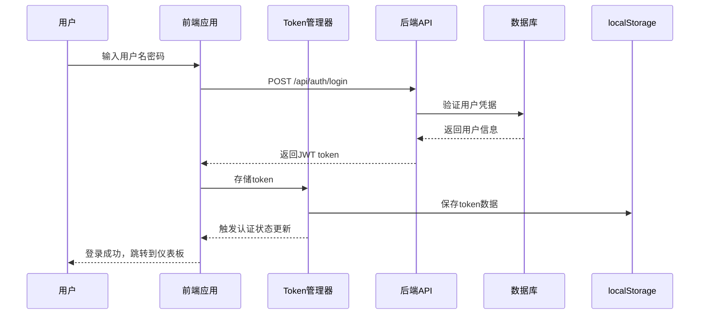

# 认证系统开发指南

## 概述

协和医院SCI期刊分析系统采用基于JWT的认证机制，支持跨标签页状态同步、自动token刷新、权限控制等高级功能。本文档详细介绍了认证系统的架构、使用方法和最佳实践。

## 系统架构

### 认证流程图



### 核心组件

#### 1. TokenManager (Token管理器)
- **位置**: `frontend/src/utils/tokenManager.ts`
- **功能**: 
  - JWT token的存储、验证和刷新
  - 跨标签页状态同步
  - 自动过期检查
  - 性能优化缓存

```typescript
import tokenManager from '../utils/tokenManager';

// 基本使用
const token = tokenManager.getToken();
const isValid = tokenManager.isTokenValid();
const expiry = tokenManager.getTokenExpiry();

// 事件监听
tokenManager.addEventListener((eventType, data) => {
  console.log('Token事件:', eventType, data);
});
```

#### 2. AuthContext (认证上下文)
- **位置**: `frontend/src/contexts/AuthContext.tsx`
- **功能**:
  - 全局认证状态管理
  - 用户登录/登出
  - 权限检查
  - 跨标签页同步

```typescript
import { useAuth } from '../contexts/AuthContext';

const MyComponent = () => {
  const { state, login, logout, hasPermission } = useAuth();
  
  const handleLogin = async () => {
    const success = await login('username', 'password');
    if (success) {
      console.log('登录成功');
    }
  };
  
  const canEdit = hasPermission('publications', 'update');
  
  return (
    <div>
      {state.isAuthenticated ? (
        <p>欢迎, {state.user?.username}</p>
      ) : (
        <button onClick={handleLogin}>登录</button>
      )}
    </div>
  );
};
```

#### 3. ProtectedRoute (路由保护)
- **位置**: `frontend/src/components/common/ProtectedRoute.tsx`
- **功能**:
  - 路由级别的认证检查
  - 权限验证
  - 自动重定向

```typescript
import ProtectedRoute from '../components/common/ProtectedRoute';

<ProtectedRoute
  requiredPermissions={['publications:read']}
  requiredRoles={['admin', 'department_admin']}
  fallbackPath="/permission-denied"
>
  <PublicationManagement />
</ProtectedRoute>
```

#### 4. API拦截器
- **位置**: `frontend/src/services/api.ts`
- **功能**:
  - 自动添加认证头
  - 401错误处理和重试
  - 文件上传特殊处理

## 认证流程

### 1. 用户登录

```typescript
// 1. 用户输入凭据
const credentials = { username: 'admin', password: 'password123' };

// 2. 调用登录API
const response = await authAPI.login(credentials);

// 3. 保存token和用户信息
const { user, token } = response.data.data;
tokenManager.setToken(token, Date.now() + 24 * 60 * 60 * 1000);
tokenManager.setUser(user);

// 4. 更新认证状态
dispatch({ type: 'LOGIN_SUCCESS', payload: { user, token } });
```

### 2. 自动认证检查

```typescript
// 应用启动时自动检查
useEffect(() => {
  const initAuth = async () => {
    const token = tokenManager.getToken();
    if (token && tokenManager.isTokenValid()) {
      try {
        // 验证token有效性
        const response = await authAPI.getCurrentUser();
        const user = response.data.data.user;
        
        // 恢复认证状态
        dispatch({ type: 'LOGIN_SUCCESS', payload: { user, token } });
      } catch (error) {
        // Token无效，清除本地存储
        tokenManager.removeToken();
        dispatch({ type: 'LOGIN_FAILURE' });
      }
    }
  };
  
  initAuth();
}, []);
```

### 3. Token刷新

```typescript
// 自动刷新即将过期的token
const refreshToken = async () => {
  try {
    if (tokenManager.isTokenExpiringSoon()) {
      const response = await authAPI.refreshToken();
      const newToken = response.data.token;
      
      tokenManager.setToken(newToken);
      return newToken;
    }
  } catch (error) {
    console.error('Token刷新失败:', error);
    // 刷新失败，重定向到登录页
    tokenManager.removeToken();
    window.location.href = '/login';
  }
};
```

### 4. 跨标签页同步

```typescript
// TokenManager自动处理跨标签页同步
tokenManager.addEventListener((eventType, data) => {
  switch (eventType) {
    case 'token_removed':
      // 其他标签页登出
      if (data?.source === 'cross_tab') {
        dispatch({ type: 'LOGOUT' });
        message.info('您已在其他标签页中登出');
      }
      break;
      
    case 'token_updated':
      // 其他标签页登录
      if (data?.source === 'cross_tab') {
        // 同步登录状态
        syncAuthState();
      }
      break;
  }
});
```

## 权限系统

### 权限模型

系统采用基于角色的访问控制(RBAC)模型：

```typescript
// 角色定义
type UserRole = 'admin' | 'department_admin' | 'user';

// 权限检查
const hasPermission = (resource: string, action: string): boolean => {
  const { role } = user;
  
  // 管理员拥有所有权限
  if (role === 'admin') return true;
  
  // 科室管理员权限
  if (role === 'department_admin') {
    const allowedPermissions = [
      'publications:read',
      'publications:create',
      'publications:update',
      'publications:delete',
      'journals:read',
      'statistics:read',
    ];
    return allowedPermissions.includes(`${resource}:${action}`);
  }
  
  // 普通用户权限
  if (role === 'user') {
    const allowedPermissions = [
      'publications:read',
      'journals:read',
      'statistics:read',
    ];
    return allowedPermissions.includes(`${resource}:${action}`);
  }
  
  return false;
};
```

### 权限使用示例

```typescript
// 组件中的权限检查
const MyComponent = () => {
  const { hasPermission, hasRole } = useAuth();
  
  const canCreatePublication = hasPermission('publications', 'create');
  const isAdmin = hasRole('admin');
  
  return (
    <div>
      {canCreatePublication && (
        <Button onClick={createPublication}>创建文献</Button>
      )}
      
      {isAdmin && (
        <AdminPanel />
      )}
    </div>
  );
};

// 路由级别的权限控制
<ProtectedRoute
  requiredPermissions={['users:read']}
  requiredRoles={['admin']}
>
  <UserManagement />
</ProtectedRoute>
```

## 性能优化

### 1. Token验证缓存

```typescript
// TokenManager自动缓存验证结果
const validateToken = async (token: string): Promise<boolean> => {
  // 检查缓存
  const cachedResult = tokenManager.getCachedTokenValidation(token);
  if (cachedResult !== null) {
    return cachedResult;
  }
  
  // 调用API验证
  try {
    await authAPI.validateToken();
    tokenManager.cacheTokenValidation(token, true);
    return true;
  } catch (error) {
    tokenManager.cacheTokenValidation(token, false, 30000); // 30秒缓存
    return false;
  }
};
```

### 2. 请求去重

```typescript
// 防止重复的认证请求
const deduplicatedValidation = await tokenManager.deduplicateRequest(
  'validate_token',
  () => authAPI.validateToken()
);
```

### 3. 内存优化

```typescript
// 自动清理过期数据
import memoryOptimizer from '../utils/memoryOptimizer';

// 添加清理任务
memoryOptimizer.addCleanupTask(() => {
  // 清理过期的权限缓存
  if (window.__PERMISSION_CACHE__) {
    // 清理逻辑
  }
});
```

## 错误处理

### 错误类型

```typescript
enum AuthErrorType {
  TOKEN_EXPIRED = 'TOKEN_EXPIRED',
  TOKEN_INVALID = 'TOKEN_INVALID',
  PERMISSION_DENIED = 'PERMISSION_DENIED',
  NETWORK_ERROR = 'NETWORK_ERROR',
  SERVER_ERROR = 'SERVER_ERROR',
}

const AUTH_ERROR_MESSAGES = {
  [AuthErrorType.TOKEN_EXPIRED]: '登录已过期，请重新登录',
  [AuthErrorType.TOKEN_INVALID]: '登录状态无效，请重新登录',
  [AuthErrorType.PERMISSION_DENIED]: '权限不足，无法访问此功能',
  [AuthErrorType.NETWORK_ERROR]: '网络连接异常，请检查网络后重试',
  [AuthErrorType.SERVER_ERROR]: '服务器错误，请稍后重试',
};
```

### 错误处理流程

```typescript
// API响应拦截器中的错误处理
apiClient.interceptors.response.use(
  (response) => response,
  async (error) => {
    const { status, data } = error.response || {};
    
    switch (status) {
      case 401:
        // Token过期或无效
        const canRetry = await handleAuthError(error);
        if (canRetry) {
          // 重试原请求
          return apiClient(error.config);
        }
        break;
        
      case 403:
        // 权限不足
        message.error(AUTH_ERROR_MESSAGES[AuthErrorType.PERMISSION_DENIED]);
        break;
        
      default:
        // 其他错误
        handleGenericError(error);
        break;
    }
    
    return Promise.reject(error);
  }
);
```

## 安全考虑

### 1. Token安全

- **存储**: 使用localStorage存储，避免XSS攻击
- **传输**: 仅通过HTTPS传输
- **过期**: 设置合理的过期时间（默认24小时）
- **刷新**: 支持自动刷新机制

### 2. 权限验证

- **前端验证**: 仅用于UI显示控制
- **后端验证**: 所有API请求都需要后端权限验证
- **最小权限**: 用户只获得必要的最小权限

### 3. 跨站请求伪造(CSRF)防护

```typescript
// API请求自动添加CSRF token
apiClient.interceptors.request.use((config) => {
  const csrfToken = document.querySelector('meta[name="csrf-token"]')?.getAttribute('content');
  if (csrfToken) {
    config.headers['X-CSRF-Token'] = csrfToken;
  }
  return config;
});
```

## 测试

### 单元测试

```typescript
// TokenManager测试
describe('TokenManager', () => {
  test('应该正确存储和获取token', () => {
    const token = 'test-token';
    const expiry = Date.now() + 3600000;
    
    tokenManager.setToken(token, expiry);
    expect(tokenManager.getToken()).toBe(token);
    expect(tokenManager.isTokenValid()).toBe(true);
  });
  
  test('应该检测过期的token', () => {
    const token = 'expired-token';
    const expiry = Date.now() - 1000; // 已过期
    
    tokenManager.setToken(token, expiry);
    expect(tokenManager.isTokenValid()).toBe(false);
  });
});
```

### 集成测试

```typescript
// 认证流程集成测试
describe('Authentication Flow', () => {
  test('完整的登录流程', async () => {
    // 1. 模拟登录
    const { result } = renderHook(() => useAuth());
    
    await act(async () => {
      const success = await result.current.login('admin', 'password123');
      expect(success).toBe(true);
    });
    
    // 2. 验证认证状态
    expect(result.current.state.isAuthenticated).toBe(true);
    expect(result.current.state.user).toBeDefined();
    
    // 3. 验证权限
    expect(result.current.hasPermission('publications', 'create')).toBe(true);
  });
});
```

### 端到端测试

```typescript
// Playwright端到端测试
test('用户登录和权限验证', async ({ page }) => {
  // 1. 访问登录页面
  await page.goto('/login');
  
  // 2. 填写登录表单
  await page.fill('[data-testid="username-input"]', 'admin');
  await page.fill('[data-testid="password-input"]', 'admin123');
  await page.click('[data-testid="login-button"]');
  
  // 3. 验证登录成功
  await expect(page).toHaveURL('/dashboard');
  await expect(page.locator('[data-testid="user-info"]')).toContainText('admin');
  
  // 4. 验证权限控制
  await page.click('[data-testid="nav-publications"]');
  await expect(page.locator('[data-testid="create-button"]')).toBeVisible();
});
```

## 最佳实践

### 1. 开发建议

- **始终检查认证状态**: 在需要认证的组件中使用`useAuth` Hook
- **合理使用权限检查**: 前端权限检查仅用于UI控制，不能替代后端验证
- **处理异步认证**: 使用loading状态处理认证检查的异步过程
- **错误处理**: 为所有认证相关操作提供适当的错误处理

### 2. 性能优化

- **缓存验证结果**: 避免重复的token验证请求
- **请求去重**: 防止并发的重复认证请求
- **内存管理**: 定期清理过期的缓存数据
- **懒加载**: 按需加载认证相关组件

### 3. 用户体验

- **加载状态**: 为认证操作提供清晰的加载反馈
- **错误提示**: 提供用户友好的错误消息
- **自动重试**: 在网络错误时自动重试
- **状态同步**: 确保跨标签页的状态一致性

## 故障排除

常见问题和解决方案请参考 [认证问题故障排除指南](./AUTHENTICATION-TROUBLESHOOTING.md)。

## 更新日志

### v2.0.0 (2024-01-31)
- ✅ 实现增强的TokenManager，支持缓存和性能优化
- ✅ 添加跨标签页状态同步功能
- ✅ 集成请求去重和内存优化
- ✅ 完善错误处理和用户体验
- ✅ 添加全面的测试覆盖

### v1.0.0 (2024-01-01)
- ✅ 基础JWT认证实现
- ✅ 角色权限系统
- ✅ API请求拦截器
- ✅ 路由保护组件