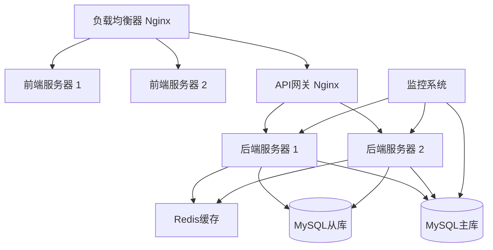

# 生产环境部署指南

## 概述

本文档详细介绍了协和医院SCI期刊分析系统在生产环境中的部署配置，包括安全设置、性能优化、监控配置等关键要素。

## 系统要求

### 硬件要求

**最低配置**:
- CPU: 4核心 2.4GHz
- 内存: 8GB RAM
- 存储: 100GB SSD
- 网络: 100Mbps

**推荐配置**:
- CPU: 8核心 3.0GHz
- 内存: 16GB RAM
- 存储: 500GB SSD
- 网络: 1Gbps

### 软件要求

- **操作系统**: Ubuntu 20.04 LTS / CentOS 8 / RHEL 8
- **Node.js**: v18.x LTS
- **MySQL**: v8.0+
- **Nginx**: v1.18+
- **PM2**: v5.x (进程管理)
- **Docker**: v20.x (可选)

## 部署架构



## 环境配置

### 1. 环境变量配置

#### 后端环境变量 (.env.production)

```bash
# 应用配置
NODE_ENV=production
PORT=3002
APP_NAME=Hospital Journal System
APP_VERSION=2.0.0

# 数据库配置
DB_HOST=localhost
DB_PORT=3306
DB_NAME=hospital_journal_prod
DB_USER=journal_user
DB_PASSWORD=your_secure_password
DB_POOL_MIN=5
DB_POOL_MAX=20

# Redis配置
REDIS_HOST=localhost
REDIS_PORT=6379
REDIS_PASSWORD=your_redis_password
REDIS_DB=0

# JWT配置
JWT_SECRET=your_very_long_and_secure_jwt_secret_key_here
JWT_EXPIRES_IN=24h
JWT_REFRESH_EXPIRES_IN=7d

# 安全配置
BCRYPT_ROUNDS=12
RATE_LIMIT_WINDOW_MS=900000
RATE_LIMIT_MAX_REQUESTS=100
CORS_ORIGIN=https://journal.hospital.com

# 文件上传配置
UPLOAD_MAX_SIZE=10485760
UPLOAD_ALLOWED_TYPES=xlsx,xls,csv
UPLOAD_PATH=/var/uploads/journal

# 邮件配置
SMTP_HOST=smtp.hospital.com
SMTP_PORT=587
SMTP_USER=noreply@hospital.com
SMTP_PASSWORD=your_smtp_password
SMTP_FROM=协和医院期刊系统 <noreply@hospital.com>

# 日志配置
LOG_LEVEL=info
LOG_FILE=/var/log/journal/app.log
LOG_MAX_SIZE=10m
LOG_MAX_FILES=5

# 监控配置
HEALTH_CHECK_INTERVAL=30000
METRICS_ENABLED=true
METRICS_PORT=9090
```

#### 前端环境变量 (.env.production)

```bash
# API配置
REACT_APP_API_URL=https://api.journal.hospital.com
REACT_APP_WS_URL=wss://api.journal.hospital.com

# 应用配置
REACT_APP_NAME=协和医院SCI期刊分析系统
REACT_APP_VERSION=2.0.0
REACT_APP_ENV=production

# 功能开关
REACT_APP_ENABLE_ANALYTICS=true
REACT_APP_ENABLE_PERFORMANCE_MONITOR=false
REACT_APP_ENABLE_DEBUG=false

# 第三方服务
REACT_APP_SENTRY_DSN=https://your-sentry-dsn
REACT_APP_GOOGLE_ANALYTICS_ID=GA-XXXXXXXXX

# 缓存配置
REACT_APP_CACHE_TTL=300000
REACT_APP_MAX_CACHE_SIZE=100

# 上传配置
REACT_APP_MAX_FILE_SIZE=10485760
REACT_APP_ALLOWED_FILE_TYPES=xlsx,xls,csv
```

### 2. 数据库配置

#### MySQL生产配置 (my.cnf)

```ini
[mysqld]
# 基本配置
port = 3306
socket = /var/lib/mysql/mysql.sock
datadir = /var/lib/mysql
user = mysql

# 字符集配置
character-set-server = utf8mb4
collation-server = utf8mb4_unicode_ci

# 内存配置
innodb_buffer_pool_size = 8G
innodb_log_file_size = 512M
innodb_log_buffer_size = 64M
key_buffer_size = 256M
max_connections = 200
thread_cache_size = 50

# 性能配置
innodb_flush_log_at_trx_commit = 2
innodb_flush_method = O_DIRECT
innodb_file_per_table = 1
query_cache_type = 1
query_cache_size = 256M

# 安全配置
bind-address = 127.0.0.1
skip-name-resolve
sql_mode = STRICT_TRANS_TABLES,NO_ZERO_DATE,NO_ZERO_IN_DATE,ERROR_FOR_DIVISION_BY_ZERO

# 日志配置
log-error = /var/log/mysql/error.log
slow_query_log = 1
slow_query_log_file = /var/log/mysql/slow.log
long_query_time = 2

# 备份配置
log-bin = /var/log/mysql/mysql-bin.log
binlog_format = ROW
expire_logs_days = 7
```

#### 数据库初始化脚本

```sql
-- 创建生产数据库
CREATE DATABASE hospital_journal_prod 
CHARACTER SET utf8mb4 
COLLATE utf8mb4_unicode_ci;

-- 创建专用用户
CREATE USER 'journal_user'@'localhost' IDENTIFIED BY 'your_secure_password';
GRANT SELECT, INSERT, UPDATE, DELETE ON hospital_journal_prod.* TO 'journal_user'@'localhost';

-- 创建只读用户（用于报表和备份）
CREATE USER 'journal_readonly'@'localhost' IDENTIFIED BY 'readonly_password';
GRANT SELECT ON hospital_journal_prod.* TO 'journal_readonly'@'localhost';

FLUSH PRIVILEGES;
```

### 3. Nginx配置

#### 主配置文件 (nginx.conf)

```nginx
user nginx;
worker_processes auto;
error_log /var/log/nginx/error.log warn;
pid /var/run/nginx.pid;

events {
    worker_connections 1024;
    use epoll;
    multi_accept on;
}

http {
    include /etc/nginx/mime.types;
    default_type application/octet-stream;

    # 日志格式
    log_format main '$remote_addr - $remote_user [$time_local] "$request" '
                    '$status $body_bytes_sent "$http_referer" '
                    '"$http_user_agent" "$http_x_forwarded_for"';

    access_log /var/log/nginx/access.log main;

    # 基本配置
    sendfile on;
    tcp_nopush on;
    tcp_nodelay on;
    keepalive_timeout 65;
    types_hash_max_size 2048;
    server_tokens off;

    # Gzip压缩
    gzip on;
    gzip_vary on;
    gzip_min_length 1024;
    gzip_proxied any;
    gzip_comp_level 6;
    gzip_types
        text/plain
        text/css
        text/xml
        text/javascript
        application/json
        application/javascript
        application/xml+rss
        application/atom+xml
        image/svg+xml;

    # 安全头
    add_header X-Frame-Options DENY;
    add_header X-Content-Type-Options nosniff;
    add_header X-XSS-Protection "1; mode=block";
    add_header Strict-Transport-Security "max-age=31536000; includeSubDomains" always;

    # 包含站点配置
    include /etc/nginx/conf.d/*.conf;
}
```

#### 前端站点配置 (journal-frontend.conf)

```nginx
server {
    listen 80;
    server_name journal.hospital.com;
    return 301 https://$server_name$request_uri;
}

server {
    listen 443 ssl http2;
    server_name journal.hospital.com;

    # SSL配置
    ssl_certificate /etc/ssl/certs/journal.hospital.com.crt;
    ssl_certificate_key /etc/ssl/private/journal.hospital.com.key;
    ssl_protocols TLSv1.2 TLSv1.3;
    ssl_ciphers ECDHE-RSA-AES256-GCM-SHA512:DHE-RSA-AES256-GCM-SHA512:ECDHE-RSA-AES256-GCM-SHA384:DHE-RSA-AES256-GCM-SHA384;
    ssl_prefer_server_ciphers off;
    ssl_session_cache shared:SSL:10m;
    ssl_session_timeout 10m;

    # 文档根目录
    root /var/www/journal-frontend/build;
    index index.html;

    # 静态资源缓存
    location ~* \.(js|css|png|jpg|jpeg|gif|ico|svg|woff|woff2|ttf|eot)$ {
        expires 1y;
        add_header Cache-Control "public, immutable";
        add_header Vary Accept-Encoding;
    }

    # API代理
    location /api/ {
        proxy_pass http://127.0.0.1:3002;
        proxy_http_version 1.1;
        proxy_set_header Upgrade $http_upgrade;
        proxy_set_header Connection 'upgrade';
        proxy_set_header Host $host;
        proxy_set_header X-Real-IP $remote_addr;
        proxy_set_header X-Forwarded-For $proxy_add_x_forwarded_for;
        proxy_set_header X-Forwarded-Proto $scheme;
        proxy_cache_bypass $http_upgrade;
        proxy_read_timeout 300s;
        proxy_connect_timeout 75s;
    }

    # SPA路由支持
    location / {
        try_files $uri $uri/ /index.html;
        add_header Cache-Control "no-cache, no-store, must-revalidate";
        add_header Pragma "no-cache";
        add_header Expires "0";
    }

    # 健康检查
    location /health {
        access_log off;
        return 200 "healthy\n";
        add_header Content-Type text/plain;
    }

    # 安全配置
    location ~ /\. {
        deny all;
    }

    location ~* \.(env|log|ini)$ {
        deny all;
    }
}
```

#### API网关配置 (journal-api.conf)

```nginx
upstream journal_backend {
    least_conn;
    server 127.0.0.1:3002 max_fails=3 fail_timeout=30s;
    # server 127.0.0.1:3003 max_fails=3 fail_timeout=30s; # 多实例负载均衡
}

server {
    listen 80;
    server_name api.journal.hospital.com;
    return 301 https://$server_name$request_uri;
}

server {
    listen 443 ssl http2;
    server_name api.journal.hospital.com;

    # SSL配置（同前端）
    ssl_certificate /etc/ssl/certs/api.journal.hospital.com.crt;
    ssl_certificate_key /etc/ssl/private/api.journal.hospital.com.key;
    ssl_protocols TLSv1.2 TLSv1.3;
    ssl_ciphers ECDHE-RSA-AES256-GCM-SHA512:DHE-RSA-AES256-GCM-SHA512:ECDHE-RSA-AES256-GCM-SHA384:DHE-RSA-AES256-GCM-SHA384;
    ssl_prefer_server_ciphers off;

    # 请求限制
    limit_req_zone $binary_remote_addr zone=api:10m rate=10r/s;
    limit_req zone=api burst=20 nodelay;

    # 文件上传限制
    client_max_body_size 10M;

    location / {
        proxy_pass http://journal_backend;
        proxy_http_version 1.1;
        proxy_set_header Upgrade $http_upgrade;
        proxy_set_header Connection 'upgrade';
        proxy_set_header Host $host;
        proxy_set_header X-Real-IP $remote_addr;
        proxy_set_header X-Forwarded-For $proxy_add_x_forwarded_for;
        proxy_set_header X-Forwarded-Proto $scheme;
        proxy_cache_bypass $http_upgrade;
        proxy_read_timeout 300s;
        proxy_connect_timeout 75s;

        # CORS配置
        add_header Access-Control-Allow-Origin "https://journal.hospital.com";
        add_header Access-Control-Allow-Methods "GET, POST, PUT, DELETE, OPTIONS";
        add_header Access-Control-Allow-Headers "Origin, X-Requested-With, Content-Type, Accept, Authorization";
        add_header Access-Control-Allow-Credentials true;

        if ($request_method = 'OPTIONS') {
            return 204;
        }
    }

    # 健康检查
    location /health {
        proxy_pass http://journal_backend/api/health;
        access_log off;
    }

    # 监控端点
    location /metrics {
        proxy_pass http://journal_backend/metrics;
        allow 127.0.0.1;
        allow 10.0.0.0/8;
        deny all;
    }
}
```

## 部署脚本

### 1. 自动化部署脚本 (deploy.sh)

```bash
#!/bin/bash

# 协和医院期刊系统生产部署脚本
# 版本: 2.0.0
# 作者: 系统管理员

set -e

# 配置变量
PROJECT_NAME="hospital-journal-system"
DEPLOY_USER="deploy"
DEPLOY_PATH="/var/www/journal"
BACKUP_PATH="/var/backups/journal"
LOG_FILE="/var/log/deploy.log"

# 颜色定义
RED='\033[0;31m'
GREEN='\033[0;32m'
YELLOW='\033[1;33m'
NC='\033[0m' # No Color

# 日志函数
log() {
    echo -e "${GREEN}[$(date +'%Y-%m-%d %H:%M:%S')] $1${NC}" | tee -a $LOG_FILE
}

warn() {
    echo -e "${YELLOW}[$(date +'%Y-%m-%d %H:%M:%S')] WARNING: $1${NC}" | tee -a $LOG_FILE
}

error() {
    echo -e "${RED}[$(date +'%Y-%m-%d %H:%M:%S')] ERROR: $1${NC}" | tee -a $LOG_FILE
    exit 1
}

# 检查运行权限
check_permissions() {
    if [[ $EUID -ne 0 ]]; then
        error "此脚本需要root权限运行"
    fi
}

# 检查系统依赖
check_dependencies() {
    log "检查系统依赖..."
    
    local deps=("node" "npm" "mysql" "nginx" "pm2")
    for dep in "${deps[@]}"; do
        if ! command -v $dep &> /dev/null; then
            error "缺少依赖: $dep"
        fi
    done
    
    log "系统依赖检查完成"
}

# 创建备份
create_backup() {
    log "创建系统备份..."
    
    local backup_dir="$BACKUP_PATH/$(date +'%Y%m%d_%H%M%S')"
    mkdir -p $backup_dir
    
    # 备份应用文件
    if [ -d "$DEPLOY_PATH" ]; then
        cp -r $DEPLOY_PATH $backup_dir/app
    fi
    
    # 备份数据库
    mysqldump -u root -p hospital_journal_prod > $backup_dir/database.sql
    
    # 备份Nginx配置
    cp -r /etc/nginx/conf.d $backup_dir/nginx
    
    log "备份完成: $backup_dir"
}

# 停止服务
stop_services() {
    log "停止相关服务..."
    
    # 停止PM2进程
    pm2 stop all || warn "PM2进程停止失败"
    
    # 重载Nginx配置
    nginx -t && nginx -s reload || warn "Nginx重载失败"
    
    log "服务停止完成"
}

# 部署后端
deploy_backend() {
    log "部署后端应用..."
    
    local backend_path="$DEPLOY_PATH/backend"
    
    # 创建目录
    mkdir -p $backend_path
    cd $backend_path
    
    # 拉取最新代码
    if [ -d ".git" ]; then
        git pull origin main
    else
        git clone https://github.com/hospital/journal-system.git .
    fi
    
    # 安装依赖
    npm ci --production
    
    # 运行数据库迁移
    npm run migrate
    
    # 复制环境配置
    cp .env.production.example .env.production
    
    log "后端部署完成"
}

# 部署前端
deploy_frontend() {
    log "部署前端应用..."
    
    local frontend_path="$DEPLOY_PATH/frontend"
    local build_path="/var/www/journal-frontend"
    
    # 创建目录
    mkdir -p $frontend_path
    cd $frontend_path
    
    # 拉取最新代码
    if [ -d ".git" ]; then
        git pull origin main
    else
        git clone https://github.com/hospital/journal-system.git .
    fi
    
    # 安装依赖
    npm ci
    
    # 构建生产版本
    npm run build
    
    # 部署到Web目录
    rm -rf $build_path
    cp -r build $build_path
    chown -R nginx:nginx $build_path
    
    log "前端部署完成"
}

# 启动服务
start_services() {
    log "启动服务..."
    
    # 启动后端服务
    cd $DEPLOY_PATH/backend
    pm2 start ecosystem.config.js --env production
    
    # 重启Nginx
    nginx -t && systemctl restart nginx
    
    # 启动监控
    pm2 start monitoring/monitor.js
    
    log "服务启动完成"
}

# 健康检查
health_check() {
    log "执行健康检查..."
    
    local max_attempts=30
    local attempt=1
    
    while [ $attempt -le $max_attempts ]; do
        if curl -f http://localhost:3002/api/health > /dev/null 2>&1; then
            log "后端服务健康检查通过"
            break
        fi
        
        if [ $attempt -eq $max_attempts ]; then
            error "后端服务健康检查失败"
        fi
        
        warn "健康检查失败，重试中... ($attempt/$max_attempts)"
        sleep 5
        ((attempt++))
    done
    
    # 检查前端
    if curl -f http://localhost/health > /dev/null 2>&1; then
        log "前端服务健康检查通过"
    else
        error "前端服务健康检查失败"
    fi
    
    log "健康检查完成"
}

# 部署后清理
cleanup() {
    log "执行部署后清理..."
    
    # 清理旧的备份（保留最近7天）
    find $BACKUP_PATH -type d -mtime +7 -exec rm -rf {} +
    
    # 清理npm缓存
    npm cache clean --force
    
    # 清理PM2日志
    pm2 flush
    
    log "清理完成"
}

# 发送通知
send_notification() {
    local status=$1
    local message="部署${status}: $PROJECT_NAME $(date +'%Y-%m-%d %H:%M:%S')"
    
    # 发送邮件通知
    echo "$message" | mail -s "部署通知" admin@hospital.com
    
    # 发送到监控系统
    curl -X POST "http://monitoring.hospital.com/api/alerts" \
         -H "Content-Type: application/json" \
         -d "{\"message\": \"$message\", \"level\": \"info\"}"
}

# 主函数
main() {
    log "开始部署 $PROJECT_NAME"
    
    check_permissions
    check_dependencies
    create_backup
    stop_services
    deploy_backend
    deploy_frontend
    start_services
    health_check
    cleanup
    
    log "部署完成"
    send_notification "成功"
}

# 错误处理
trap 'error "部署过程中发生错误"; send_notification "失败"' ERR

# 执行主函数
main "$@"
```

### 2. PM2配置文件 (ecosystem.config.js)

```javascript
module.exports = {
  apps: [
    {
      name: 'journal-api',
      script: './src/app.js',
      instances: 'max',
      exec_mode: 'cluster',
      env: {
        NODE_ENV: 'development',
        PORT: 3002
      },
      env_production: {
        NODE_ENV: 'production',
        PORT: 3002
      },
      error_file: '/var/log/journal/api-error.log',
      out_file: '/var/log/journal/api-out.log',
      log_file: '/var/log/journal/api-combined.log',
      time: true,
      max_memory_restart: '1G',
      node_args: '--max-old-space-size=1024',
      watch: false,
      ignore_watch: ['node_modules', 'logs'],
      max_restarts: 10,
      min_uptime: '10s',
      kill_timeout: 5000,
      wait_ready: true,
      listen_timeout: 10000
    },
    {
      name: 'journal-worker',
      script: './src/workers/index.js',
      instances: 2,
      exec_mode: 'fork',
      env_production: {
        NODE_ENV: 'production'
      },
      error_file: '/var/log/journal/worker-error.log',
      out_file: '/var/log/journal/worker-out.log',
      cron_restart: '0 2 * * *', // 每天凌晨2点重启
      max_memory_restart: '512M'
    }
  ],
  
  deploy: {
    production: {
      user: 'deploy',
      host: ['journal-server-1', 'journal-server-2'],
      ref: 'origin/main',
      repo: 'git@github.com:hospital/journal-system.git',
      path: '/var/www/journal',
      'post-deploy': 'npm install && npm run migrate && pm2 reload ecosystem.config.js --env production',
      'pre-setup': 'apt-get install git -y'
    }
  }
};
```

## 监控和日志

### 1. 系统监控配置

```javascript
// monitoring/monitor.js
const express = require('express');
const prometheus = require('prom-client');
const mysql = require('mysql2/promise');

const app = express();
const register = new prometheus.Registry();

// 创建指标
const httpRequestDuration = new prometheus.Histogram({
  name: 'http_request_duration_seconds',
  help: 'Duration of HTTP requests in seconds',
  labelNames: ['method', 'route', 'status_code'],
  buckets: [0.1, 0.5, 1, 2, 5]
});

const dbConnectionPool = new prometheus.Gauge({
  name: 'db_connection_pool_size',
  help: 'Current database connection pool size'
});

const activeUsers = new prometheus.Gauge({
  name: 'active_users_total',
  help: 'Number of active users'
});

register.registerMetric(httpRequestDuration);
register.registerMetric(dbConnectionPool);
register.registerMetric(activeUsers);

// 收集默认指标
prometheus.collectDefaultMetrics({ register });

// 监控端点
app.get('/metrics', async (req, res) => {
  try {
    res.set('Content-Type', register.contentType);
    res.end(await register.metrics());
  } catch (error) {
    res.status(500).end(error);
  }
});

// 健康检查
app.get('/health', async (req, res) => {
  try {
    // 检查数据库连接
    const connection = await mysql.createConnection({
      host: process.env.DB_HOST,
      user: process.env.DB_USER,
      password: process.env.DB_PASSWORD,
      database: process.env.DB_NAME
    });
    
    await connection.execute('SELECT 1');
    await connection.end();
    
    res.json({
      status: 'healthy',
      timestamp: new Date().toISOString(),
      uptime: process.uptime(),
      memory: process.memoryUsage()
    });
  } catch (error) {
    res.status(500).json({
      status: 'unhealthy',
      error: error.message
    });
  }
});

const PORT = process.env.METRICS_PORT || 9090;
app.listen(PORT, () => {
  console.log(`监控服务启动在端口 ${PORT}`);
});
```

### 2. 日志配置

```javascript
// src/utils/logger.js
const winston = require('winston');
const path = require('path');

const logger = winston.createLogger({
  level: process.env.LOG_LEVEL || 'info',
  format: winston.format.combine(
    winston.format.timestamp(),
    winston.format.errors({ stack: true }),
    winston.format.json()
  ),
  defaultMeta: { service: 'journal-api' },
  transports: [
    // 错误日志
    new winston.transports.File({
      filename: path.join(process.env.LOG_PATH || '/var/log/journal', 'error.log'),
      level: 'error',
      maxsize: 10 * 1024 * 1024, // 10MB
      maxFiles: 5
    }),
    
    // 综合日志
    new winston.transports.File({
      filename: path.join(process.env.LOG_PATH || '/var/log/journal', 'combined.log'),
      maxsize: 10 * 1024 * 1024,
      maxFiles: 5
    }),
    
    // 控制台输出（开发环境）
    ...(process.env.NODE_ENV !== 'production' ? [
      new winston.transports.Console({
        format: winston.format.combine(
          winston.format.colorize(),
          winston.format.simple()
        )
      })
    ] : [])
  ]
});

module.exports = logger;
```

## 安全配置

### 1. 防火墙配置

```bash
#!/bin/bash
# firewall-setup.sh

# 清除现有规则
iptables -F
iptables -X
iptables -t nat -F
iptables -t nat -X

# 设置默认策略
iptables -P INPUT DROP
iptables -P FORWARD DROP
iptables -P OUTPUT ACCEPT

# 允许本地回环
iptables -A INPUT -i lo -j ACCEPT
iptables -A OUTPUT -o lo -j ACCEPT

# 允许已建立的连接
iptables -A INPUT -m state --state ESTABLISHED,RELATED -j ACCEPT

# 允许SSH (端口22)
iptables -A INPUT -p tcp --dport 22 -j ACCEPT

# 允许HTTP和HTTPS
iptables -A INPUT -p tcp --dport 80 -j ACCEPT
iptables -A INPUT -p tcp --dport 443 -j ACCEPT

# 允许MySQL (仅本地)
iptables -A INPUT -p tcp -s 127.0.0.1 --dport 3306 -j ACCEPT

# 允许Redis (仅本地)
iptables -A INPUT -p tcp -s 127.0.0.1 --dport 6379 -j ACCEPT

# 允许监控端口 (仅内网)
iptables -A INPUT -p tcp -s 10.0.0.0/8 --dport 9090 -j ACCEPT

# 防止DDoS攻击
iptables -A INPUT -p tcp --dport 80 -m limit --limit 25/minute --limit-burst 100 -j ACCEPT
iptables -A INPUT -p tcp --dport 443 -m limit --limit 25/minute --limit-burst 100 -j ACCEPT

# 保存规则
iptables-save > /etc/iptables/rules.v4
```

### 2. SSL证书配置

```bash
#!/bin/bash
# ssl-setup.sh

# 使用Let's Encrypt获取SSL证书
certbot --nginx -d journal.hospital.com -d api.journal.hospital.com

# 设置自动续期
echo "0 12 * * * /usr/bin/certbot renew --quiet" | crontab -
```

## 备份策略

### 1. 数据库备份脚本

```bash
#!/bin/bash
# backup-database.sh

BACKUP_DIR="/var/backups/mysql"
DB_NAME="hospital_journal_prod"
DATE=$(date +%Y%m%d_%H%M%S)
BACKUP_FILE="$BACKUP_DIR/${DB_NAME}_${DATE}.sql"

# 创建备份目录
mkdir -p $BACKUP_DIR

# 执行备份
mysqldump -u backup_user -p$BACKUP_PASSWORD \
  --single-transaction \
  --routines \
  --triggers \
  $DB_NAME > $BACKUP_FILE

# 压缩备份文件
gzip $BACKUP_FILE

# 删除7天前的备份
find $BACKUP_DIR -name "*.sql.gz" -mtime +7 -delete

# 上传到云存储（可选）
# aws s3 cp $BACKUP_FILE.gz s3://hospital-backups/database/
```

### 2. 应用备份脚本

```bash
#!/bin/bash
# backup-application.sh

BACKUP_DIR="/var/backups/application"
APP_DIR="/var/www/journal"
DATE=$(date +%Y%m%d_%H%M%S)
BACKUP_FILE="$BACKUP_DIR/journal_app_${DATE}.tar.gz"

# 创建备份目录
mkdir -p $BACKUP_DIR

# 创建应用备份
tar -czf $BACKUP_FILE \
  --exclude='node_modules' \
  --exclude='*.log' \
  --exclude='.git' \
  $APP_DIR

# 删除30天前的备份
find $BACKUP_DIR -name "*.tar.gz" -mtime +30 -delete
```

## 性能优化

### 1. 数据库优化

```sql
-- 创建索引
CREATE INDEX idx_publications_department_year ON publications(departmentId, publishYear);
CREATE INDEX idx_publications_journal ON publications(journalId);
CREATE INDEX idx_journals_name ON journals(name);
CREATE INDEX idx_users_username ON users(username);

-- 分析表统计信息
ANALYZE TABLE publications;
ANALYZE TABLE journals;
ANALYZE TABLE users;
ANALYZE TABLE departments;
```

### 2. 缓存配置

```javascript
// src/middleware/cache.js
const redis = require('redis');
const client = redis.createClient({
  host: process.env.REDIS_HOST,
  port: process.env.REDIS_PORT,
  password: process.env.REDIS_PASSWORD
});

const cache = (duration = 300) => {
  return async (req, res, next) => {
    const key = `cache:${req.originalUrl}`;
    
    try {
      const cached = await client.get(key);
      if (cached) {
        return res.json(JSON.parse(cached));
      }
      
      // 重写res.json以缓存响应
      const originalJson = res.json;
      res.json = function(data) {
        client.setex(key, duration, JSON.stringify(data));
        return originalJson.call(this, data);
      };
      
      next();
    } catch (error) {
      next();
    }
  };
};

module.exports = cache;
```

## 故障恢复

### 1. 自动故障转移脚本

```bash
#!/bin/bash
# failover.sh

PRIMARY_HOST="journal-server-1"
BACKUP_HOST="journal-server-2"
VIP="10.0.0.100"

check_primary() {
    curl -f http://$PRIMARY_HOST:3002/api/health > /dev/null 2>&1
}

failover_to_backup() {
    echo "主服务器故障，切换到备份服务器"
    
    # 移除VIP从主服务器
    ssh root@$PRIMARY_HOST "ip addr del $VIP/24 dev eth0" || true
    
    # 添加VIP到备份服务器
    ssh root@$BACKUP_HOST "ip addr add $VIP/24 dev eth0"
    
    # 更新DNS记录
    # update_dns_record journal.hospital.com $BACKUP_HOST
    
    # 发送告警
    echo "故障转移完成" | mail -s "系统故障转移" admin@hospital.com
}

# 主循环
while true; do
    if ! check_primary; then
        failover_to_backup
        break
    fi
    sleep 30
done
```

### 2. 数据恢复脚本

```bash
#!/bin/bash
# restore-database.sh

BACKUP_FILE=$1
DB_NAME="hospital_journal_prod"

if [ -z "$BACKUP_FILE" ]; then
    echo "用法: $0 <backup_file>"
    exit 1
fi

echo "开始恢复数据库..."

# 停止应用服务
pm2 stop all

# 创建恢复数据库
mysql -u root -p -e "DROP DATABASE IF EXISTS ${DB_NAME}_restore;"
mysql -u root -p -e "CREATE DATABASE ${DB_NAME}_restore CHARACTER SET utf8mb4 COLLATE utf8mb4_unicode_ci;"

# 恢复数据
if [[ $BACKUP_FILE == *.gz ]]; then
    gunzip -c $BACKUP_FILE | mysql -u root -p ${DB_NAME}_restore
else
    mysql -u root -p ${DB_NAME}_restore < $BACKUP_FILE
fi

# 验证恢复
echo "验证数据恢复..."
mysql -u root -p -e "USE ${DB_NAME}_restore; SELECT COUNT(*) FROM users; SELECT COUNT(*) FROM publications;"

echo "数据恢复完成，请手动切换数据库"
```

---

**最后更新**: 2024-01-31  
**版本**: v2.0.0  
**维护者**: 系统管理员团队